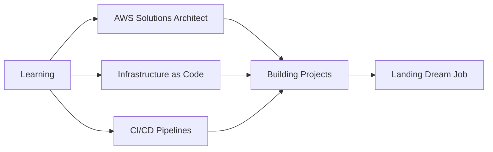

```ascii
╔══════════════════════════════════════════════════════════════════════════════╗
║                                                                              ║
║   ██████╗ ██╗      ██████╗ ██╗   ██╗██████╗      ██████╗ ███████╗██╗   ██╗ ║
║  ██╔════╝ ██║     ██╔═══██╗██║   ██║██╔══██╗     ██╔══██╗██╔════╝██║   ██║ ║
║  ██║      ██║     ██║   ██║██║   ██║██║  ██║     ██║  ██║█████╗  ██║   ██║ ║
║  ██║      ██║     ██║   ██║██║   ██║██║  ██║     ██║  ██║██╔══╝  ╚██╗ ██╔╝ ║
║  ╚██████╗ ███████╗╚██████╔╝╚██████╔╝██████╔╝     ██████╔╝███████╗ ╚████╔╝  ║
║   ╚═════╝ ╚══════╝ ╚═════╝  ╚═════╝ ╚═════╝      ╚═════╝ ╚══════╝  ╚═══╝   ║
║                                                                              ║
╚══════════════════════════════════════════════════════════════════════════════╝
```

<div align="center">

### Building the Cloud Infrastructure of Tomorrow

**`Software Engineer | Cloud Architect | DevOps Enthusiast`**

[LinkedIn](https://gh.linkedin.com/in/fadeel-darkwa-709b08230)  • [Email](fadeeldarkwa19@gmail.com)

</div>

---

## About Me

```python
class CloudEngineer:
    def __init__(self):
        self.name = "Fadeel Darkwa"
        self.location = "Accra, Ghana"
        self.role = "Aspiring Cloud & DevOps Engineer"
        self.learning_focus = ["AWS", "Serverless Architecture", "Infrastructure as Code"]
        
    def current_mission(self):
        return """
        Transforming ideas into scalable cloud solutions.
        Building automated systems that actually work.
        Learning something new every single day.
        """
    
    def tech_philosophy(self):
        return "Automate everything. Monitor everything. Learn from everything."

me = CloudEngineer()
print(me.current_mission())
```

---

## Technical Arsenal

<details open>
<summary><b>Cloud & Infrastructure</b></summary>

```
AWS Services
├── Compute          : Lambda, EC2
├── Storage          : S3, EBS
├── Networking       : VPC, CloudFront
├── Monitoring       : CloudWatch
├── Security         : IAM, Security Groups
└── Messaging        : SNS, SQS
```

**Cloud Skills:**
- Serverless Architecture Design
- Event-Driven Systems
- Cross-Region Replication
- Infrastructure Automation
- Cost Optimization Strategies

</details>

<details>
<summary><b>Development & Languages</b></summary>

**Languages I Speak:**

| Language | Proficiency | Use Case |
|----------|------------|----------|
| Python | ████████░░ 80% | Cloud automation, scripting |
| JavaScript | ███████░░░ 70% | Frontend development, Node.js |
| HTML/CSS | ████████░░ 80% | Web interfaces, responsive design |
| Bash | ██████░░░░ 60% | System automation, DevOps scripts |

</details>

<details>
<summary><b>DevOps & Tools</b></summary>

```yaml
devops_toolkit:
  version_control: [Git, GitHub]
  cloud_platforms: [AWS]
  scripting: [Python, Bash]
  monitoring: [CloudWatch, AWS X-Ray]
  infrastructure: [CloudFormation (learning), Terraform (learning)]
  ci_cd: [GitHub Actions (learning)]
  containerization: [Docker (learning)]
```

</details>

<details>
<summary><b>Frontend Technologies</b></summary>

- HTML5 & CSS3
- JavaScript (ES6+)
- Responsive Design
- React (Learning)

</details>

---

## Current Focus



**What I'm Working On:**
- AWS Solutions Architect Associate Certification
- Building production-ready cloud projects for portfolio
- Deep diving into Terraform and Infrastructure as Code
- Contributing to open source projects
- Writing technical documentation

---

## Featured Projects

### AWS S3 Automated Backup System
*Serverless disaster recovery solution with cross-region replication*

```
Status: Production Ready | Tech: AWS Lambda, S3, SNS, Python
```

**What it does:** Automatically replicates uploaded files to a backup bucket in a different AWS region, sends email notifications, and logs everything for monitoring.

**Key Features:**
- Event-driven serverless architecture
- Real-time cross-region backup
- Comprehensive error handling
- Cost-effective pay-per-use model

[View Project →](https://github.com/fadeel7/aws-s3-automated-backup-system)

---

### More Projects Coming Soon

```bash
$ git commit -m "feat: new cloud projects in progress"
[main 1a2b3c4] feat: new cloud projects in progress
 3 files changed, 247 insertions(+)
 
$ git push origin main
Counting objects: 100% complete
Writing: 100% complete
Building the future...
```

**In Development:**
- Serverless REST API with API Gateway and DynamoDB
- Terraform-managed AWS infrastructure
- CI/CD pipeline for automated deployments
- Container orchestration with ECS

---

## Problem-Solving Approach

```javascript
const approach = {
  understand: "Break down complex problems into manageable pieces",
  research: "Leverage documentation, communities, and best practices",
  implement: "Build iteratively with testing at each stage",
  optimize: "Refine for performance, cost, and maintainability",
  document: "Share knowledge through clear documentation",
  iterate: "Continuously improve based on feedback"
};

// This is how I build everything
```

---

## Learning Philosophy

> "The cloud isn't just about technology. It's about solving real problems, automating tedious tasks, and building systems that scale effortlessly. Every project teaches me something new about resilience, architecture, and engineering excellence."

**What Drives Me:**
- Building things that actually matter
- Automating repetitive tasks
- Learning by doing, not just watching
- Understanding the "why" behind the "how"
- Sharing knowledge with others

---


## Connect & Collaborate

```python
def lets_connect():
    """
    I'm always interested in:
    - Cloud engineering opportunities
    - Collaborative projects
    - Knowledge sharing
    - Mentorship and learning
    """
    return "Let's build something amazing together!"
```

**I'm particularly interested in:**
- Junior Cloud Engineer positions
- DevOps engineering roles
- Open source contributions
- Collaborative learning projects
- Technical discussions about AWS and automation

---

## Recent Activity

<!--START_SECTION:activity-->
<!--END_SECTION:activity-->

---

## Fun Facts

```bash
$ cat fun_facts.txt

> I believe every problem can be solved with the right architecture
> I read AWS documentation for fun (yes, really)
> My dream is to architect systems used by millions
```

---

## Support My Journey

If you find my projects helpful or want to support my learning journey:

- Star repositories you find useful
- Share feedback on my code
- Suggest improvements or new project ideas
- Connect with me on LinkedIn
- Share opportunities in cloud engineering

---

<div align="center">

### "The best way to predict the future is to build it."

**Thanks for stopping by! Let's build the cloud together.**


</div>

---

<sub>Last updated: November 2025 | Built with markdown and determination</sub>
